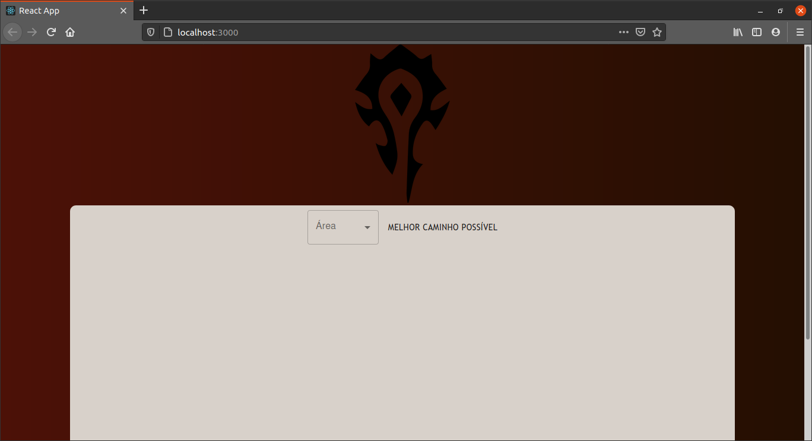
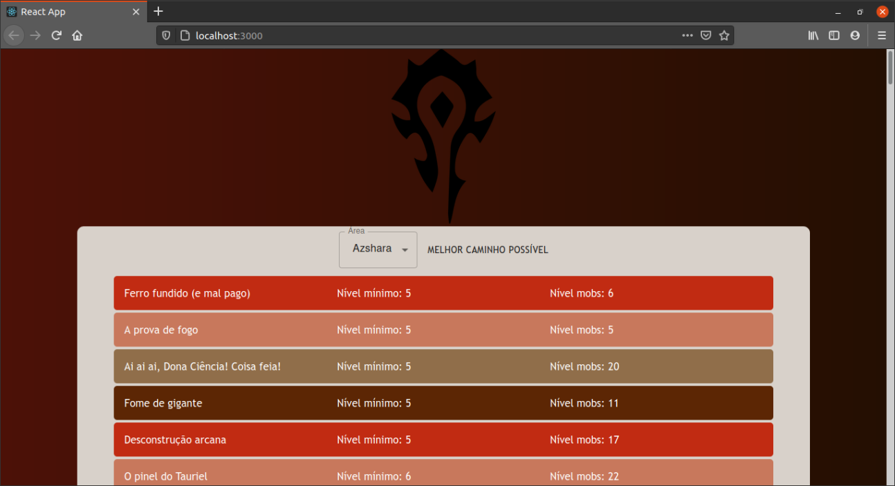
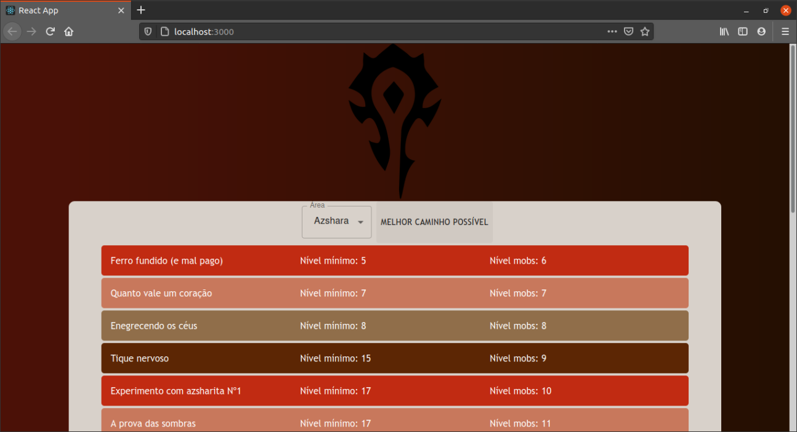

# WoW Quest Selector

**Número da Lista**: Não se aplica<br>
**Conteúdo da Disciplina**: Programação dinâmica<br>

## Alunos
|Matrícula | Aluno |
| -- | -- |
| 17/0103471  |  Gabriel Marques Tiveron |
| 17/0115208  |  Victor Levi Peixoto |

## Sobre 
O projeto visa encontrar a maior sequencia crescente dentre  os níveis das missões nas áreas do jogo World of Warcraft utilizando um algorítmo de programação dinâmica.

## Screenshots

Tela inicial


Tela com lista de missões de uma área desordenada


Após a ordenação com maior sequência possível


## Instalação 
**Linguagem**: JavaScript<br>
**Framework**: React.js<br>
Para executar o projeto basta ter o [npm](https://www.npmjs.com/get-npm),
para instalar o npm num sistema linux basta rodar o comando 
```
$ sudo apt install npm
OU
$ sudo apt install npm nodejs
```
e instalar as dependências por meio do comando ```npm install``` dentro da pasta frontend.
Por fim, para rodar o projeto é necessário executar o comando ```npm start``` e acessar num
navegador qualquer a url ```localhost:3000```.

## Uso 
A utilização é simples, basta selecionar a Área que se deseja ver as missões e o programa trará a lista de missões, após é possível clicar no botão "MELHOR CAMINHO POSSÍVEL" e então o programa traçará a maior sequência crescente utilizando um algorítmo de programação dinâmica.

## Outros 
Quaisquer outras informações sobre seu projeto podem ser descritas abaixo.


